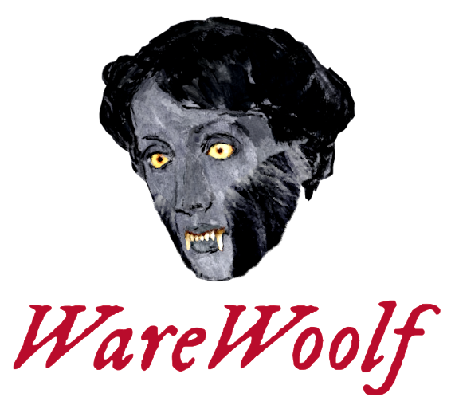

	

v2.2.1

"The only writing software I use." -Virginia Woolf

WareWoolf is designed for one thing: writing fiction. It is intentionally simplified: you cannot change the font, line spacing, or color. But it has everything you need to organize, edit, and revise a novel--and you don't even need a mouse.

It is composed of three simple text-based panels with no icons: Chapters, Editor, and Notes.

That's it. There is no toolbar with twenty buttons cluttering the screen. There isn't even a file menu unless you summon it by pressing Alt. All formatting is done with shortcuts. (But don't worry, there aren't many to memorize, and you can always press **CTRL** + **H** to show them all in the Shortcut Helper. It's not like you do a lot of formatting when writing fiction anyway.)

What it does have is an array of tools for importing plaintext and docx files and converting them into proper manuscript format, as well as features such as self-emailing drafts at the press of a button, a built-in file manager, a wi-fi manager, and a battery monitor for easy use in standalone writing devices ("writerDecks") without access to any other software.

Dark Mode:

Light Mode:

Corkboard:

For a more in-depth overview of WareWoolf, please see [the Wiki](https://github.com/brsloan/warewoolf/wiki).

## Features

* All-keyboard navigation designed for pleasant use without a mouse.
* Distraction-free writing: Each of the three panels can be toggled on/off at the press of a button. Write with only your manuscript visible.
* Plain text import/conversion tools
   * Options to parse a simplified version of Markdown (MarkdownFic) or interpret custom markers for detecting italics, headings, etc.
   * Detect custom strings marking chapter breaks or break text into chapters at each heading, etc.
* Easily re-order chapters and automatically re-number them in headings after doing so ("Chapter One," "Chapter Two," etc.)
* Compile chapters into single manuscript or export into individual files for each chapter
* Keep notes on each chapter and project as a whole
* "Reference" section of chapters list holds documents you don't want included in compile or word counts. Keep character lists, location info, etc.
* Send Via Email: Email drafts of individual chapters or the entire manuscript to yourself at the press of a button.
* Built In File Manager: Rename, delete, copy, move, and organize files within WareWoolf (for use in a writerDeck).
* Built In Wi-Fi Manager: turn wi-fi on/off, connect to new networks, etc. (Linux only, for use in a writerDeck).
* Built In Battery Monitor: display battery percentage (Linux only, for use in a writerDeck)
* Word Counts / Goal: See total count, chapter count, session count, and set a goal to see a progress bar showing how close you are to completion.
* Each chapter is saved as an individual file only loaded when you are working on that chapter. This keeps very long novels from slowing the application at all, even with low-memory computers such as a Raspberry Pi.
* Outliner.
* Corkboard that saves as a markdown file that doubles as an outline.
* Adjust width of text editor and how large text is displayed.
* Spellcheck, but it must be run after writing (no form of auto-correct or red squiggles or godawful grammar advice).
* Word .docx support for import/export
* Auto-saving and auto-backup options
* Saves chapters as .txt files with light Markdown-style formatting, so even if WareWoolf disappears you will always be able to read/edit the documents you create with it. This is also widely considered the most "archival" file format, so people will still be able to open your files in 100 years (if people still read then).
* Export as plain text, markdownFic, standard markdown, docx, HTML, or .epub 

## Installation

Binaries of the current release for Windows, MacOS, Debian AMD64, and Debian ARM64 (Raspberry Pi) are available in the [releases page](https://github.com/brsloan/warewoolf/releases).

> [!WARNING]
> The Wi-Fi Manager uses nmcli/Network Manager, which Raspberry Pi OS does not have installed/enabled by default. You will have to install network-manager and enable it in raspi-config for this function to work. You may need to update raspi-config to be able to enable Network-Manager.

## Run or Build From Source

This app was built using Electron Forge. To run it from source...

* You must first have [Node.js](https://nodejs.dev/en/learn/how-to-install-nodejs/) installed.
* Run "npm install" in the WareWoolf source code directory to install the dependencies using the Node Package Manager, or however you like.
* Then you can simply use command "npm start" to run the program.
* To make a binary, "npm run make". See the [Electron Forge documentation](https://www.electronforge.io/) for instructions on how to alter the package.json file for making binaries for different systems, but basically in the "makers" property of the "forge" object in the package.json file, there is an array of different makers for producing different binaries. The "@electron-forge/maker-squirrel" is for producing a Windows binary, the maker-deb for Debian, and the maker-rpm for Redhat. To produce one, delete the other two from the file before running "npm run make". You will find the binary in the "out" folder.  

## Documentation

For a more in-depth overview of WareWoolf, please see [the Wiki](https://github.com/brsloan/warewoolf/wiki).

## Status

2025-10-09: v2.2.1. Changes made:
* This is a patch to fix a couple bugs I introduced/missed in last update which broke restoring chapters from trash and creating new projects. (Obviously these are embarrassing to have released and I plan to implement testing scripts to catch these issues in future. I've gotten a little too excited about releasing new features this month and was careless.)
* Added an alert that updates on progress when backing up files on close so it doesn't seem to freeze momentarily.
* Refactored code for readability.

2025-10-07: v2.2.0. Changes made:
* .epub export/compile. Meant for quickly generating .epub ebook files for sharing with first readers, etc.
* "Reference" function lets you keep non-compiling documents in your project for planning, notes, etc. Move any chapter to end of chapter list, then move down one more space, and it will shift into "Reference" section and no longer count toward word count or be included in compile. Can move back into compiling chapters in same way (moving up).
* Chapter Notes added. Notes panel can be toggled between the old Project Notes, which stays the same as you change chapters, and the new Chapter Notes, which are attached to each individual chapter and update as you cycle through.
* Project/Chapter Notes now save as separate .txt files just like the chapters do.
* Corkboard exports with rest of project
* Various bug fixes, including that corkboard feature was broken in Windows (oops) and now works.

2025-09-28: v2.1.0! Changes made:
* Corkboard feature for pre-planning/outlining novels. Displays as color-coded digital index cards but saves as plain text "project_corkboard.txt" markdown document, so can be edited/prewritten in other apps.
* Export/Compile as standard Markdown or HTML
* Can now open .woolf files directly (user must set WareWoolf to default program in Windows, but it is automatic on MacOS)
* Battery Charge Display option (Linux only, for use in writerdecks)
* Custom PageDown key behavior. Now scrolls in perfect intervals so that you can seamlessly read long chapters. When you press Page Down, it will jump forward so that the line after the last line visible will be at the top of the text editor. Default behavior would only scroll far enough for the next line to move up to 1/3rd down in the text editor, breaking reading flow because you had to re-find where you were each time.
* Various bug fixes.

2024-03-30: v2.0.0! I know that's a quick version jump, but this has some fundamental changes, primarily the switch to saving chapters as plain text .txt files with MarkdownFic markdown for formatting. This is better than the previous ".pup" json files because even if you and WareWoolf both die and your tech illiterate uncle is your executor, he will still be able to open the .txt chapter files of your manuscript and publish it so that history can remember you as the genius no one recognized while you were alive. Also you can edit them in any other text editor and as long you don't change the filename WareWoolf will load them as normal. Changes Made:
* Completely new MarkdownFic parsing algorithm (about 1000x faster)
* Now saves chapters as plain text .txt files with MarkdownFic markup for formatting rather than Delta ".pup" JSON files. 
  * Can still open legacy files, just will silently save over old file format with new at open.
* Autogenerated subdirectory for chapter files now named "[filename]_chapters" instead of "[filename]_pups".
* Chapter files now saved as "[title].txt" rather than arbitrary numbers. Filename updates when you change chapter titles in WareWoolf.
* Now supports MacOS
* Missing Chapters tool rewritten/expanded
* Can now toggle full screen on Windows/Mac
* Can now export single chapter or all
* Bug fixes

2024-03-16: v1.1.0. Changes made:
* Download and install updates in-app through About screen
  * Only checks for updates on user request.
* File Manager filters out hidden files/directories
* Refactored entire codebase to use proper isolated modules for maintainability
* Wi-Fi Manager now shows IP Address
* Bug fixes

2024-03-03: We have reached version 1.0.0! All the basic features I had originally envisioned are now implemented and working. I use it daily for my own novel writing. Features added/changed since last release:
* Built-in Wi-Fi Manager (on Linux) for use as writerDeck
* Import .docx files
* Footnote support (import and export/compile)
* Auto-save at set intervals (if desired)
* Auto-backup with single zip file on close
* Email zipped project file
* Built-in File Manager now can unzip zip files
* Dark Mode support/options
* Markdown improvements
* Docx export drastically improved, with automatic cover page generation, page number headers in Standard Manuscript Format, etc. Can now export ready-to-submit manuscript documents
* Retains more settings user sets for email attachments, etc.
* Replaced native file dialogs with custom in-app for better keyboard-only workflow
* Bug fixes
* 70% less ugly

2023-06-11: Releasing v0.10.0-beta. Improvements: built-in file manager, Properties tool now allows altering project's chapters directory location. About now shows license. Minor fixes.

2023-05-28: After testing and improving the alpha version for almost a year and writing 30,000 words on a new novel with WareWoolf, I have finally decided it is ready for a beta release. I am numbering it v0.9.0. Now I just have to figure out how to go about "releasing" it...

2022-07-09: WareWoolf is currently in the alpha stage, which is to say I'm using it myself and ironing out the bugs I come across. I hope to do a beta release soon.
