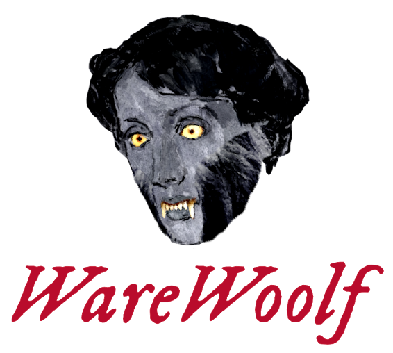

	

v3.0.0

"The only writing software I use." -Virginia Woolf

WareWoolf is designed for one thing: writing fiction. It is intentionally simplified: beyond a choice of typeface for the manuscript and the sidebars, and light or dark, there is nothing to fiddle with--no line spacing, no colors, no styles. But it has everything you need to organize, edit, and revise a novel--and you don't even need a mouse.

It is composed of three simple text-based panels with no icons: Chapters, Editor, and Notes.

That's it. There is no toolbar with twenty buttons cluttering the screen. There isn't even a file menu unless you summon it by pressing Alt. All formatting is done with shortcuts. (But don't worry, there aren't many to memorize, and you can always press **CTRL** + **H** to show them all in the Shortcut Helper--where you can also change any of them to keys you prefer. It's not like you do a lot of formatting when writing fiction anyway.)

What it does have is an array of tools for importing plaintext and docx files and converting them into proper manuscript format, as well as features such as self-emailing drafts at the press of a button, a built-in file manager, a wi-fi manager, and a battery monitor for easy use in standalone writing devices ("writerDecks") without access to any other software.

Light Mode:

Dark Mode:

Corkboard:

For a more in-depth overview of WareWoolf, please see [the Wiki](https://github.com/brsloan/warewoolf/wiki).

## Features

* All-keyboard navigation designed for pleasant use without a mouse.
   * Accessibility named/labeled for screen readers (not yet tested with one)
* Distraction-free writing: Each of the three panels can be toggled on/off at the press of a button. Write with only your manuscript visible.
* The formatting fiction actually needs, all of it on a shortcut and none of it on a toolbar: bold, italics, underline, strikethrough, four levels of heading, left/right/center/justified alignment, bulleted and numbered lists, and blockquotes as well as footnotes.
* Plain text import/conversion tools
   * Options to parse a simplified version of Markdown (MarkdownFic) or interpret custom markers for detecting italics, headings, etc.
   * Detect custom strings marking chapter breaks or break text into chapters at each heading, etc.
* Easily re-order chapters and automatically re-number them in headings after doing so ("Chapter One," "Chapter Two," etc.)
* Compile chapters into single manuscript or export into individual files for each chapter
* Keep notes on each chapter and project as a whole
* "Reference" section of chapters list holds documents you don't want included in compile or word counts. Keep character lists, location info, etc.
* Send Via Email: Email drafts of individual chapters or the entire manuscript to yourself at the press of a button.
* Built In File Manager: Rename, delete, copy, move, and organize files within WareWoolf (for use in a writerDeck).
* Built In Wi-Fi Manager: turn wi-fi on/off, connect to new networks, etc. (Linux only, for use in a writerDeck).
* Built In Battery Monitor: display battery percentage (Linux only, for use in a writerDeck)
* File > Reboot: restart the machine from inside the app, after the usual save prompt and auto-backup (Linux only, for use in a writerDeck).
* Word Counts / Goal: See total count, chapter count, session count, and set a goal to see a progress bar showing how close you are to completion.
* Each chapter is saved as an individual file only loaded when you are working on that chapter. This keeps very long novels from slowing the application at all, even with low-memory computers such as a Raspberry Pi.
* Outliner.
* Corkboard that saves as a markdown file that doubles as an outline.
* Adjust width of text editor and how large text is displayed.
* Choose a typeface for the manuscript and another for the sidebars (File > Settings), from serif and sans through Times, Garamond and a typewriter face to Atkinson Hyperlegible and OpenDyslexic. A sample under each dropdown shows what your machine will actually draw.
* Customizable keyboard shortcuts: rebind any shortcut in the Shortcut Helper (Ctrl+H), or restore the defaults, and your choices are remembered.
* Automatic substitutions as you type: smart quotes, em dashes from two hyphens, and an ellipsis from three periods. Ctrl+Z undoes any one of them, and the whole thing can be switched off in Settings. A Tools item applies the same conversions to an existing manuscript in one pass.
* Spellcheck, but it must be run after writing (no red squiggles or godawful grammar advice). Check against any number of dictionaries at once (File > Dictionaries), import your own, and keep a personal word list alongside a per-project one for character and place names that shouldn't follow you into your next book.
* Word .docx support for import/export
* Auto-saving and auto-backup options
* Saves chapters as .txt files with light Markdown-style formatting, so even if WareWoolf disappears you will always be able to read/edit the documents you create with it. This is also widely considered the most "archival" file format, so people will still be able to open your files in 100 years (if people still read then).
* Export as plain text, markdownFic, standard markdown, docx, HTML, or .epub 
* Import HTML files and EPUB ebooks, splitting a whole book into chapters as it reads - at headings or horizontal rules for HTML, and by the ebook's own table of contents for EPUB.

## Installation

Binaries of the current release for Windows (installer and portable), MacOS, Debian AMD64, and Debian ARM64 (Raspberry Pi) are available in the [releases page](https://github.com/brsloan/warewoolf/releases).

> [!NOTE]
> **Can't install anything on the machine you write on?** The Windows download comes in two forms. `warewoolf_<version>_Windows_x64.exe` is the ordinary installer, and it is the one to take if you can: it puts WareWoolf in your Start Menu and can update itself in place. `warewoolf_<version>_Windows_Portable_x64.zip` is the same application as a folder you unzip and run — nothing is installed, nothing is written outside it but your settings, and deleting the folder removes it. Good for a USB stick, a shared or locked-down machine, or trying WareWoolf without committing to it. Check For Updates works in both: the portable build is offered the next portable zip rather than the installer, and updating it means replacing the folder with the one inside.

> [!NOTE]
> **On an older Mac?** The main MacOS builds are packaged against Electron 44, which needs macOS 13 "Ventura" or newer. If you are on macOS 10.15 "Catalina" through 12 "Monterey" — as many of the older laptops people turn into writerdecks are — download `warewoolf_<version>_MacOS_Legacy.dmg` instead. It is the same WareWoolf, built from the same source, packaged against Electron 32: the last release line that runs on those systems. It is an Intel build, so on Apple Silicon it runs under Rosetta. Electron 32 no longer receives Chromium security updates, so take a mainline build instead if your Mac can run one.

> [!WARNING]
> The Wi-Fi Manager uses nmcli/Network Manager, which Raspberry Pi OS does not have installed/enabled by default. You will have to install network-manager and enable it in raspi-config for this function to work. You may need to update raspi-config to be able to enable Network-Manager.

## Run or Build From Source

This app was built using Electron Forge. To run it from source...

* You must first have [Node.js](https://nodejs.dev/en/learn/how-to-install-nodejs/) installed.
* Run "npm install" in the WareWoolf source code directory to install the dependencies using the Node Package Manager.
* Then you can simply use command "npm start" to run the program.
* **Building on an older Mac.** Two pins in package.json exist for this and are deliberate. `esbuild` is held at 0.23.x because 0.24.0 is built with Go 1.23, which dropped macOS 10.15 — anything newer fails to install on Catalina with a `dyld: Symbol not found` error. Node 20 is the newest release line that runs on Catalina at all, and it is also what Electron 32 bundles, so tests there run on roughly the runtime the app ships with. To run or package the legacy Mac build locally, use "npm run use:legacy-electron" after "npm install"; it swaps in Electron 32 without touching package.json or the lockfile, and "npm ci" puts the mainline Electron back. You do not need any of this to *release* the legacy build — CI produces that asset on every tagged release, on an ordinary macOS runner, since electron-forge only downloads a prebuilt Electron for the target and copies the app into it.
* To make a binary, "npm run make". See the [Electron Forge documentation](https://www.electronforge.io/) for instructions on how to alter the package.json file for making binaries for different systems, but basically in the "makers" property of the "forge" object in the package.json file, there is an array of different makers for producing different binaries. The "@electron-forge/maker-squirrel" is for producing a Windows binary, the maker-deb for Linux, and the maker-dmg for MacOS. To produce them, run "npm run make" and it should use the appropriate one for your system. You will find the binary in the "out" folder.  

## Documentation

For a more in-depth overview of WareWoolf, please see [the Wiki](https://github.com/brsloan/warewoolf/wiki).

## Status

The current release is **v2.5.0**, with unreleased changes on the `dev` branch.

For the full release history - every version back to the v0.9.0 beta, plus the pre-release development that led to it - see [CHANGELOG.md](CHANGELOG.md).
